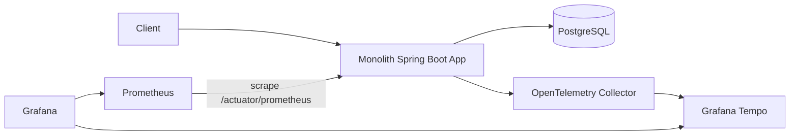

# AGENTS.md

## Project Overview

Project Name: `monolith-otel-lab`

이 프로젝트는 **모놀리식 Spring Boot 애플리케이션에서 OpenTelemetry와 Grafana Tempo를 적용했을 때 어떤 효과가 있는지 간단히 검증하는 실험 프로젝트**이다.

목표는 MSA 환경이 아니더라도 단일 애플리케이션 내부에서 다음 흐름을 추적할 수 있음을 확인하는 것이다.

```text
HTTP Request
  -> Controller
  -> Service / UseCase
  -> Repository (JPA)
  -> DB (PostgreSQL)
  -> Fake External Dependency
  -> Response
```

이 프로젝트는 운영용 서비스가 아니라, **관측성 적용 관점의 학습·검증용 프로젝트**이다.

---

## Core Goal

코드 에이전트는 다음을 구현한다.

1. 단일 프로세스 모놀리식 Spring Boot API 서버
2. 주문 생성 API
3. 내부 계층별 OpenTelemetry span 생성 (Micrometer Observation 기반)
4. Grafana Tempo로 trace 전송
5. Grafana에서 요청 흐름 확인
6. Prometheus/Grafana 기반 최소 metrics 확인
7. JSON log에 `trace_id`, `span_id` 포함

---

## Non-Goals

이번 프로젝트에서 하지 않을 것:

- MSA 구성
- Kubernetes 배포
- 인증/인가 구현
- 복잡한 도메인 모델링
- 실제 결제 API 연동
- 실제 운영 수준의 알림 체계
- 대규모 부하 테스트
- 완전한 APM 제품 구현

---

## Tech Stack

기본 스택은 다음을 사용한다.

```text
Language:        Java 21 (LTS)
Framework:       Spring Boot 3 (Spring MVC)
Build:           Gradle (Groovy DSL) + Gradle Wrapper
Persistence:     Spring Data JPA (Hibernate)
Database:        PostgreSQL
Observability:   Micrometer Observation + Micrometer Tracing (OpenTelemetry bridge)
Trace Export:    OTLP -> OpenTelemetry Collector
Trace Backend:   Grafana Tempo
Metrics:         Micrometer + Spring Boot Actuator (Prometheus registry)
Dashboard:       Grafana
Local Runtime:   Docker Compose
Logging:         Logback structured JSON logger
```

가능하면 외부 프레임워크 의존성은 최소화하고, Spring Boot가 제공하는 기능을 우선 사용한다.

> 관측성 방식 선택 근거: Spring Boot 3의 Micrometer Observation은 하나의 Observation으로
> trace span과 metric을 함께 생성하며 Spring MVC/JDBC를 자동 계측한다. 계층별 커스텀 span은
> `@Observed`(또는 `ObservationRegistry`)로 명시적으로 만든다. (`.workspace/decisions/ADR-0004` 참고)

---

## Architecture Rule

이 프로젝트는 **모놀리식**이다.

단, 코드 구조는 관측성 실험을 위해 내부 모듈(패키지)을 명확히 나눈다.

```text
Single Process
Single Deployment Unit
Single Database
Multiple Internal Modules (Java packages)
```

서비스를 여러 개로 쪼개지 않는다.

좋은 구조 (base package: `com.sangjinsu.monolithotellab`):

```text
com.sangjinsu.monolithotellab
  ├── web         (REST controller, exception handler)
  ├── order       (service, JPA entity, repository, dto)
  ├── inventory   (service)
  ├── payment     (fake client)
  └── platform
        ├── observability   (Observation/Tracing 설정)
        ├── persistence     (datasource/JPA 보조 설정, 필요 시)
        └── logging         (structured logging 설정, 필요 시)
```

피해야 할 구조:

```text
services/order-service
services/payment-service
services/inventory-service
```

이 프로젝트는 MSA가 아니다.

---

## Required User Scenario

다음 API를 구현한다.

### 1. Health Check

```http
GET /healthz
```

응답:

```json
{
  "status": "ok"
}
```

> 참고: Spring Boot Actuator의 `GET /actuator/health`도 함께 노출하되, 스펙 충족을 위해
> 별도의 `GET /healthz` 엔드포인트를 제공한다.

### 2. Create Order

```http
POST /orders
Content-Type: application/json
```

요청:

```json
{
  "user_id": "user-1",
  "items": [
    {
      "sku": "item-1",
      "quantity": 2
    }
  ]
}
```

응답:

```json
{
  "order_id": "generated-order-id",
  "status": "created"
}
```

### 3. Get Order

```http
GET /orders/{order_id}
```

응답:

```json
{
  "order_id": "generated-order-id",
  "user_id": "user-1",
  "status": "created",
  "items": [
    {
      "sku": "item-1",
      "quantity": 2
    }
  ]
}
```

### 4. Failure Test

실패 trace를 확인할 수 있도록 다음 옵션을 제공한다.

```http
POST /orders?fail_payment=true
```

이 경우 fake payment 단계에서 의도적으로 에러를 발생시킨다.

응답 예시 (HTTP 402):

```json
{
  "error": "payment authorization failed"
}
```

---

## Trace Design

주문 생성 요청 하나는 최소한 다음 span 구조를 가져야 한다.

```text
HTTP POST /orders                      (Spring MVC 자동 root span)
  -> OrderController.createOrder
  -> OrderService.createOrder
  -> InventoryService.reserve
  -> PaymentClient.authorize
  -> OrderRepository.insert            (JPA save / JDBC)
```

> 호출 순서: `InventoryService.reserve` -> `PaymentClient.authorize` -> `OrderRepository.insert`.
> 결제 실패 시 주문을 저장하지 않는다.

각 span은 명확한 이름을 가져야 한다. Micrometer Observation의 `contextualName`(또는 `@Observed`)으로
span 이름을 지정한다.

좋은 span 이름:

```text
OrderController.createOrder
OrderService.createOrder
InventoryService.reserve
PaymentClient.authorize
OrderRepository.insert
```

나쁜 span 이름:

```text
function
process
do
run
logic
```

---

## OpenTelemetry Requirements

### Resource Attributes

모든 telemetry에는 다음 resource attribute를 포함한다.

```text
service.name=monolith-otel-lab
service.version=0.1.0
deployment.environment=local
```

`service.name`은 `spring.application.name`으로 설정하고, version/environment는
`management.opentelemetry.resource-attributes`로 추가한다.

### Trace Export

애플리케이션은 OTLP exporter를 사용해 OpenTelemetry Collector로 trace를 전송한다.
Spring Boot의 OTLP exporter는 기본적으로 HTTP/protobuf를 사용한다.

기본 endpoint:

```text
management.otlp.tracing.endpoint=http://otel-collector:4318/v1/traces
```

로컬 실행 시에는 환경변수로 endpoint를 변경할 수 있어야 한다
(예: `OTEL_EXPORTER_OTLP_ENDPOINT` 또는 `MANAGEMENT_OTLP_TRACING_ENDPOINT`).

### Sampling

로컬 실험 환경에서는 모든 trace를 수집한다.

```text
management.tracing.sampling.probability=1.0
```

추후 확장용으로 ratio 기반 sampling 설정이 가능하도록 구성값으로 분리한다.

### Context Propagation

Spring MVC(동기 Servlet) 환경에서는 Micrometer Observation이 ThreadLocal 기반으로
trace context를 자동 전파한다. 따라서 Go처럼 `context.Context`를 수동으로 넘기지 않는다.

대신 다음 규칙을 지킨다.

- 계층 경계가 되는 메서드는 `@Observed` 또는 `ObservationRegistry`로 감싸 span을 만든다.
- 비동기/스레드 분리가 필요한 경우 `Observation`/`ContextSnapshot`으로 context를 전파한다.

좋은 예:

```java
@Observed(name = "order.create", contextualName = "OrderService.createOrder")
public Order createOrder(CreateOrderCommand command) { ... }
```

---

## Span Attribute Rules

span에는 디버깅에 유용한 attribute(Observation key value)를 추가한다.

예시:

```text
order.id
user.id
item.count
db.system
db.operation
payment.provider
payment.result
```

단, 개인정보나 민감정보는 넣지 않는다.

넣으면 안 되는 값:

```text
password
access_token
refresh_token
authorization header
phone number
email
payment card number
raw request body
```

---

## Error Handling in Traces

에러가 발생하면 반드시 span에 기록한다.

Observation API는 `observation.error(throwable)`로 에러를 기록하며, 이는 span error로 변환된다.
저수준 OTel Span을 직접 다룰 경우 다음에 대응한다.

```text
span.recordException(throwable)
span.setStatus(StatusCode.ERROR)
```

실패 케이스는 다음에서 확인 가능해야 한다.

```http
POST /orders?fail_payment=true
```

Grafana Tempo에서 해당 trace를 열었을 때 `PaymentClient.authorize` span이 error 상태로 보여야 한다.

---

## Metrics Requirements

메트릭은 **Micrometer + Spring Boot Actuator(Prometheus registry)**로 구현한다.
Prometheus는 애플리케이션의 `/actuator/prometheus`를 직접 scrape한다.
(trace는 Collector를 경유하지만, metric은 actuator를 직접 scrape하는 Spring 표준 방식을 사용한다.)

최소한 다음 metrics를 확인할 수 있어야 한다.

```text
http.server.requests            (Micrometer 기본: count + duration 히스토그램)
order.created.count             (커스텀 Counter)
order.failed.count              (커스텀 Counter)
```

가능하면 Prometheus에서 다음 관점으로 볼 수 있게 한다.

```text
요청 수
요청 지연 시간
주문 생성 성공 수
주문 생성 실패 수
```

> Prometheus 표기에서 이름은 `http_server_requests_seconds_count`,
> `order_created_count_total` 등으로 변환되어 보인다.
> README에 metrics 방식(Micrometer/Actuator)을 명시한다.

---

## Logging Requirements

로그는 JSON 형식으로 출력한다 (Logback structured logging 또는 JSON encoder).

모든 request 로그에는 가능하면 다음 값을 포함한다.

```text
timestamp
level
message
trace_id
span_id
method
path
status
duration_ms
```

Micrometer Tracing은 MDC에 `traceId`/`spanId`를 주입한다. JSON 로그에 이를 포함하여
`trace_id`/`span_id`로 노출한다(필드명 매핑).

예시:

```json
{
  "level": "INFO",
  "message": "request completed",
  "trace_id": "abc123",
  "span_id": "def456",
  "method": "POST",
  "path": "/orders",
  "status": 201,
  "duration_ms": 123
}
```

로그와 trace를 연결할 수 있어야 한다.

---

## Docker Compose Requirements

다음 서비스를 `docker-compose.yml`에 포함한다.

```text
app
postgres
otel-collector
tempo
prometheus
grafana
```

선택 사항:

```text
loki
jaeger
pyroscope
```

초기 버전에서는 선택 사항을 구현하지 않아도 된다.

---

## Expected Local Ports

가능하면 다음 포트를 사용한다.

```text
app:             http://localhost:8080
grafana:         http://localhost:3000
prometheus:      http://localhost:9090
postgres:        localhost:5432
tempo:           internal only
otel-collector:  localhost:4317, localhost:4318
```

Grafana 기본 계정:

```text
admin / admin
```

---

## Directory Structure

다음 구조를 목표로 한다 (Gradle + Java 표준).

```text
.
├── AGENTS.md
├── README.md
├── Makefile
├── docker-compose.yml
├── Dockerfile
├── .dockerignore
├── build.gradle
├── settings.gradle
├── gradlew / gradlew.bat
├── gradle/wrapper/...
├── src
│   ├── main
│   │   ├── java/com/sangjinsu/monolithotellab
│   │   │   ├── MonolithOtelLabApplication.java
│   │   │   ├── web
│   │   │   │   ├── HealthController.java
│   │   │   │   ├── OrderController.java
│   │   │   │   └── GlobalExceptionHandler.java
│   │   │   ├── order
│   │   │   │   ├── Order.java
│   │   │   │   ├── OrderItem.java
│   │   │   │   ├── OrderRepository.java
│   │   │   │   ├── OrderService.java
│   │   │   │   └── dto (CreateOrderRequest, OrderResponse, ...)
│   │   │   ├── inventory
│   │   │   │   └── InventoryService.java
│   │   │   ├── payment
│   │   │   │   └── FakePaymentClient.java
│   │   │   └── platform
│   │   │       └── observability (ObservabilityConfig.java)
│   │   └── resources
│   │       ├── application.yml
│   │       └── logback-spring.xml
│   └── test
│       └── java/com/sangjinsu/monolithotellab/...
├── deploy
│   ├── otel-collector/config.yaml
│   ├── tempo/tempo.yaml
│   ├── prometheus/prometheus.yml
│   └── grafana/provisioning
│       ├── datasources/datasources.yaml
│       └── dashboards/dashboards.yaml
│       (+ grafana/dashboards/monolith-otel-lab.json)
└── scripts/load.sh
```

---

## Implementation Steps

### Step 1. Bootstrap Spring Boot API Server

구현할 것:

- `GET /healthz`
- `POST /orders`
- `GET /orders/{order_id}`
- JSON request/response (DTO)
- graceful shutdown (`server.shutdown=graceful`)

---

### Step 2. Add Domain Flow

주문 생성 흐름을 다음 순서로 구현한다.

```text
OrderController.createOrder
  -> OrderService.createOrder
  -> InventoryService.reserve
  -> PaymentClient.authorize
  -> OrderRepository.insert (JPA save)
```

`PaymentClient.authorize`는 실제 외부 API를 호출하지 않는다.

대신 다음 동작을 한다.

```text
기본: 50~300ms sleep 후 성공
fail_payment=true: 100ms sleep 후 실패
```

---

### Step 3. Add JPA + PostgreSQL

JPA 엔티티로 주문 정보를 저장한다.

최소 테이블(Hibernate `ddl-auto` 또는 `schema.sql`):

```sql
CREATE TABLE IF NOT EXISTS orders (
  id          VARCHAR(64) PRIMARY KEY,
  user_id     VARCHAR(64) NOT NULL,
  status      VARCHAR(32) NOT NULL,
  created_at  TIMESTAMP   NOT NULL
);

CREATE TABLE IF NOT EXISTS order_items (
  id        BIGSERIAL PRIMARY KEY,
  order_id  VARCHAR(64) NOT NULL REFERENCES orders(id),
  sku       VARCHAR(64) NOT NULL,
  quantity  INTEGER     NOT NULL
);
```

---

### Step 4. Add OpenTelemetry Tracing (Micrometer Observation)

다음 위치에 span을 추가한다.

```text
Spring MVC 요청 (자동 root span: http.server.requests)
OrderController.createOrder
OrderService.createOrder
InventoryService.reserve
PaymentClient.authorize
OrderRepository.insert / findById
```

`@Observed` 사용을 위해 `ObservedAspect` 빈을 등록한다(`spring-boot-starter-aop`).
JPA/JDBC 쿼리 span이 필요하면 datasource observation 또는 수동 Observation으로 보강한다.

---

### Step 5. Add OpenTelemetry Collector

`deploy/otel-collector/config.yaml`을 작성한다.

필수 구성:

```text
receivers:
  otlp:
    protocols:
      grpc:
      http:

processors:
  batch:

exporters:
  otlp/tempo:
    endpoint: tempo:4317
    tls:
      insecure: true

  debug:

service:
  pipelines:
    traces:
      receivers: [otlp]
      processors: [batch]
      exporters: [otlp/tempo, debug]
```

> metric은 app actuator(`/actuator/prometheus`)를 Prometheus가 직접 scrape하므로
> Collector의 metrics 파이프라인은 필수가 아니다(필요 시 추가 가능).
> 필요하면 실제 Collector 버전에 맞춰 config 문법을 조정한다.

---

### Step 6. Add Tempo

`deploy/tempo/tempo.yaml`을 작성한다.

목표:

- OTLP trace 수신
- 로컬 저장
- Grafana datasource에서 조회 가능

운영용 object storage는 사용하지 않는다.

---

### Step 7. Add Grafana Provisioning

Grafana datasource를 자동 설정한다.

필수 datasource:

```text
Tempo
Prometheus
```

추가로 최소 대시보드(요청 수/지연, 주문 성공/실패)를 provisioning한다.
Grafana에서 trace 조회가 가능해야 한다.

---

### Step 8. Add Prometheus

Prometheus는 다음 target을 scrape한다.

```text
app:8080  (/actuator/prometheus)
```

필요하면 otel-collector의 metric endpoint도 scrape한다.

---

## Makefile Requirements

다음 명령을 제공한다.

```makefile
make up
make down
make logs
make test
make load
```

동작:

```text
make up      -> docker compose up --build
make down    -> docker compose down -v
make logs    -> docker compose logs -f app otel-collector
make test    -> ./gradlew test
make load    -> scripts/load.sh 실행
```

> Makefile은 `COMPOSE ?= docker compose` 변수를 사용해 런타임을 override할 수 있게 한다.

---

## Load Test Script

`scripts/load.sh`는 간단한 요청을 여러 번 보낸다.

예시:

```bash
#!/usr/bin/env bash
set -euo pipefail

for i in {1..20}; do
  curl -s -X POST "http://localhost:8080/orders" \
    -H "Content-Type: application/json" \
    -d '{"user_id":"user-1","items":[{"sku":"item-1","quantity":2}]}' \
    > /dev/null
done

curl -s -X POST "http://localhost:8080/orders?fail_payment=true" \
  -H "Content-Type: application/json" \
  -d '{"user_id":"user-1","items":[{"sku":"item-1","quantity":2}]}' \
  || true

echo "done"
```

---

## README Requirements

README에는 다음 내용을 포함한다.

### 1. Project Purpose

이 프로젝트가 모놀리식 Spring Boot에서 OpenTelemetry와 Tempo를 테스트하기 위한 실험 프로젝트임을 설명한다.

### 2. Architecture Diagram

Mermaid로 간단히 작성한다.



### 3. Run

```bash
make up
```

### 4. Generate Traffic

```bash
make load
```

### 5. Open Grafana

```text
http://localhost:3000
admin / admin
```

### 6. What to Check

Grafana Tempo에서 다음 trace를 확인한다.

```text
POST /orders
  -> OrderController.createOrder
  -> OrderService.createOrder
  -> InventoryService.reserve
  -> PaymentClient.authorize
  -> OrderRepository.insert
```

실패 trace도 확인한다.

```text
POST /orders?fail_payment=true
```

이 trace에서는 `PaymentClient.authorize` span이 error 상태여야 한다.

---

## Acceptance Criteria

작업 완료 기준은 다음과 같다.

### Functional

- [ ] `GET /healthz`가 200 응답을 반환한다.
- [ ] `POST /orders`가 주문을 생성한다.
- [ ] `GET /orders/{order_id}`가 주문을 조회한다.
- [ ] `POST /orders?fail_payment=true`가 의도적으로 실패한다.

### Observability

- [ ] Grafana에서 Tempo datasource가 보인다.
- [ ] `POST /orders` trace를 Grafana에서 조회할 수 있다.
- [ ] trace 안에 controller, service, inventory, payment, repository span이 보인다.
- [ ] 실패 요청에서 error span이 기록된다.
- [ ] JSON log에 `trace_id`, `span_id`가 포함된다.
- [ ] Prometheus에서 최소 request/order 관련 metric을 확인할 수 있다.

### Developer Experience

- [ ] `make up`으로 전체 환경이 실행된다.
- [ ] `make down`으로 전체 환경이 정리된다.
- [ ] `make load`로 테스트 트래픽을 만들 수 있다.
- [ ] README만 보고 실행할 수 있다.

---

## Coding Rules

코드 에이전트는 다음 규칙을 지킨다.

1. 계층 경계 메서드는 Micrometer Observation(`@Observed` 등)으로 span을 만든다.
2. span 이름은 계층과 책임이 드러나게 작성한다 (`OrderService.createOrder`).
3. span attribute(observation key value)에 민감정보를 넣지 않는다.
4. 에러는 span(observation.error)과 log 양쪽에 남긴다.
5. Docker Compose로 재현 가능해야 한다.
6. README 없이도 코드 구조가 이해되도록 패키지명을 명확히 한다.
7. 관측성 설정 코드는 비즈니스 로직을 과도하게 침범하지 않도록 `platform/observability`에 모은다.
8. 실험 프로젝트이므로 과한 추상화는 피한다.
9. 처음부터 완벽한 production 구성을 만들지 않는다.
10. local-first 실행 경험을 우선한다.

---

## Suggested Implementation Order for Agent

코드 에이전트는 다음 순서로 작업한다.

```text
1. Spring Boot(Gradle) 프로젝트 초기화
2. HTTP 서버와 health check 구현
3. 주문 도메인 구현
4. JPA + PostgreSQL 저장소 구현
5. 기본 테스트 추가 (JUnit5 / MockMvc / Testcontainers)
6. Micrometer Observation tracing 추가
7. JSON logging + trace_id 연동
8. Dockerfile 작성
9. docker-compose.yml 작성 (postgres 포함)
10. otel-collector / tempo / prometheus / grafana 설정 추가
11. Makefile 추가
12. scripts/load.sh 추가
13. README 작성
14. acceptance criteria 기준으로 자체 검증
```

---

## Optional Extensions

기본 구현 이후 선택적으로 추가할 수 있다.

### Option 1. Jaeger Backend

Tempo 대신 Jaeger를 붙여본다.

목적:

```text
같은 OpenTelemetry instrumentation을 유지하면서 backend만 교체 가능한지 확인
```

### Option 2. Loki

JSON log를 Loki로 수집한다.

목적:

```text
trace_id 기반으로 trace와 log를 연결
```

### Option 3. Pyroscope

Java 애플리케이션의 CPU profiling을 확인한다.

목적:

```text
느린 요청이 코드의 어느 메서드에서 CPU를 많이 사용하는지 확인
```

### Option 4. Modular Monolith Comparison

현재 구조를 유지하되 내부 모듈을 더 명확히 분리한다(Spring Modulith 등).

목적:

```text
모듈러 모놀리식에서 span 설계가 더 명확해지는지 확인
```

---

## Final Output Expected

코드 에이전트는 최종적으로 다음 결과물을 만들어야 한다.

```text
- 실행 가능한 Spring Boot monolith app
- docker-compose 기반 관측성 스택 (postgres 포함)
- OpenTelemetry trace 적용 (Micrometer Observation)
- Tempo 연동
- Prometheus metrics 확인 (actuator)
- Grafana datasource 자동 설정 + 최소 대시보드
- README 실행 문서
- make 명령어
- 간단한 테스트 트래픽 스크립트
```

최종 확인 명령:

```bash
make up
make load
```

확인 URL:

```text
App:        http://localhost:8080/healthz
Grafana:    http://localhost:3000
Prometheus: http://localhost:9090
```

---

## LLM Wiki / Workspace Memory

이 프로젝트는 코드 구현뿐 아니라, LLM 기반 코드 에이전트가 작업 과정에서 내린 판단, 계획, 변경 히스토리, 프로젝트 스펙을 지속적으로 기록한다.

이를 위해 프로젝트 루트에 `.workspace` 디렉터리를 둔다.

`.workspace`는 애플리케이션 런타임 데이터 저장소가 아니다.
오직 **LLM 작업 맥락, 프로젝트 문서, 판단 기록, 구현 계획, 검증 결과**를 저장하기 위한 작업 위키이다.

### Workspace Purpose

```text
1. LLM이 왜 이런 구조를 선택했는지 기록
2. 현재 구현 계획과 남은 작업을 기록
3. 프로젝트 스펙과 관측성 설계를 유지
4. 구현 히스토리와 검증 결과를 남김
5. 다음 LLM 세션이 이어서 작업할 수 있도록 handoff 문서 제공
```

### Workspace Directory Structure

코드 에이전트는 프로젝트 생성 시 다음 구조를 반드시 만든다.

```text
.workspace
├── README.md
├── project
│   ├── spec.md
│   ├── architecture.md
│   ├── observability-design.md
│   └── glossary.md
├── plans
│   ├── current-plan.md
│   └── backlog.md
├── decisions
│   ├── ADR-0001-project-scope.md
│   ├── ADR-0002-monolith-structure.md
│   ├── ADR-0003-otel-tempo-stack.md
│   ├── ADR-0004-observability-micrometer.md
│   ├── ADR-0005-database-postgresql-jpa.md
│   └── ADR-0006-language-springboot-java.md
├── history
│   ├── changelog.md
│   └── implementation-log.md
├── validation
│   ├── acceptance-checklist.md
│   └── test-results.md
├── experiments
│   ├── trace-scenario-baseline.md
│   └── failure-trace-scenario.md
├── prompts
│   └── agent-handoff.md
└── notes
    └── open-questions.md
```

> 위 파일들은 실제로 `.workspace/`에 생성되어 있다. 아래 규칙에 따라 작업 전후로 갱신한다.

### Workspace Rules

**Before Implementation** — 작업 전 다음을 읽는다.

```text
.workspace/README.md
.workspace/project/spec.md
.workspace/project/architecture.md
.workspace/project/observability-design.md
.workspace/plans/current-plan.md
.workspace/decisions/*.md
```

**During Implementation** — 중요한 변경 시 다음을 갱신한다.

```text
.workspace/plans/current-plan.md
.workspace/history/implementation-log.md
.workspace/validation/acceptance-checklist.md
```

아키텍처/기술 선택/관측성 설계가 바뀌면 ADR을 추가한다(`.workspace/decisions/ADR-000X-title.md`).

**After Implementation** — 작업 종료 시 다음을 갱신한다.

```text
.workspace/history/changelog.md
.workspace/history/implementation-log.md
.workspace/validation/test-results.md
.workspace/prompts/agent-handoff.md
```

### Important Rule: Do Not Store Hidden Chain-of-Thought

`.workspace`에는 LLM의 내부 추론 전문을 저장하지 않는다.
대신 **판단 요약**(Decision / Rationale Summary / Alternatives / Trade-offs / Confidence / Follow-up)을 남긴다.

### Forbidden Content

```text
API key / access token / refresh token / password
개인 식별 정보 / 민감한 사용자 정보
LLM의 숨겨진 chain-of-thought 전문
```

### ADR Template

```md
# ADR-000X: Title

## Status
Accepted

## Context
어떤 문제가 있었는가?

## Decision
무엇을 결정했는가?

## Rationale Summary
왜 이렇게 결정했는가?

## Alternatives Considered
### Option A
장점 / 단점
### Option B
장점 / 단점

## Consequences
이 결정으로 인해 생기는 영향은 무엇인가?

## Follow-up
나중에 검토해야 할 것은 무엇인가?
```

### Required Initial ADRs

```text
ADR-0001 project scope        : 운영 서비스가 아닌 모놀리식 관측성 실험 프로젝트
ADR-0002 monolith structure   : 단일 프로세스/배포/DB + 내부 모듈(패키지) 분리
ADR-0003 otel/tempo stack     : OTel Collector + Tempo + Prometheus + Grafana
ADR-0004 observability        : Micrometer Observation/Tracing (OTel bridge)
ADR-0005 database             : PostgreSQL + Spring Data JPA
ADR-0006 language/framework   : Java 21 + Spring Boot 3 (Gradle)
```

### AGENTS.md Update Rule

코드 에이전트는 작업 중 아래 상황이 발생하면 `AGENTS.md`를 임의로 수정하지 말고, 먼저
`.workspace/notes/open-questions.md`에 제안으로 기록한다. (단, 사용자가 직접 수정을 지시하면 따른다.)

```text
- 프로젝트 목표 변경
- 주요 기술 스택 변경
- 모놀리식에서 MSA로 구조 변경
- Tempo 외 trace backend 변경
- .workspace 구조 변경
```

단순 구현 계획, 작업 로그, 테스트 결과는 `AGENTS.md`가 아니라 `.workspace`에 기록한다.

### Workspace Priority

문서 간 우선순위는 다음과 같다.

```text
1. AGENTS.md
2. .workspace/project/spec.md
3. .workspace/decisions/*.md
4. .workspace/plans/current-plan.md
5. README.md
6. 코드 주석
```

충돌이 있을 경우 `AGENTS.md`를 우선한다.

### Final Requirement

프로젝트 초기 생성 작업에는 반드시 `.workspace` 디렉터리와 위 파일들(spec/architecture/
observability-design, current-plan, 초기 ADR, acceptance-checklist, agent-handoff)이 포함되어야 한다.

코드 구현이 끝났더라도 `.workspace`가 갱신되지 않았다면 작업은 완료된 것으로 보지 않는다.

---

## Changelog of This Spec

```text
v1: Go(net/http) + SQLite + OpenTelemetry Go SDK 기반 스펙
v2: Spring Boot 3(Java 21) + Spring Data JPA + PostgreSQL + Micrometer Observation 기반으로 전환
    (사용자 지시. 관측성 목적/시나리오/acceptance criteria는 유지)
```
