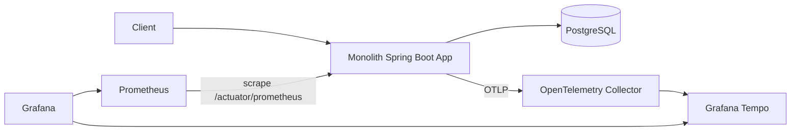

# monolith-otel-lab

모놀리식 **Spring Boot** 애플리케이션에 **OpenTelemetry**와 **Grafana Tempo**를 적용해, 단일 프로세스
안에서 요청이 계층(Controller → Service → Inventory → Payment → Repository → DB)을 따라 흐르는 모습을
trace / metrics / logs로 관측할 수 있는지 검증하는 **실험 프로젝트**다.

> MSA가 아니다. 목적은 "모놀리식 내부 요청 흐름을 어떻게 관측하는가"를 보여주는 것이다.

## 📚 학습 자료로 사용하기

이 저장소는 교재처럼 읽고 실습할 수 있게 구성되어 있다. **처음이라면 study-guide부터.**

| 문서 | 내용 |
|---|---|
| [docs/study-guide.md](docs/study-guide.md) | 읽기 순서 · 실습 체크포인트 8개 · 연습문제 6개 · FAQ |
| [docs/architecture.md](docs/architecture.md) | 구성도 — 토폴로지, 계층, 요청 시퀀스, 설정 파일 지도 |
| [docs/observability-deep-dive.md](docs/observability-deep-dive.md) | 동작 원리 — `@Observed`가 Tempo의 span이 되기까지 |
| [.workspace/](.workspace/README.md) | 설계 결정 기록(ADR 6종) · 스펙 · 검증 결과 — "왜 이렇게 만들었나" |

## Architecture



## Tech Stack

| 영역 | 선택 |
|---|---|
| Language / Framework | Java 21, Spring Boot 3 (Spring MVC) |
| Build | Gradle (Groovy) + Wrapper |
| Persistence | Spring Data JPA (Hibernate) |
| Database | PostgreSQL |
| Tracing | Micrometer Observation + Micrometer Tracing (OpenTelemetry bridge) → OTLP |
| Trace backend | Grafana Tempo |
| Metrics | **Micrometer + Spring Boot Actuator (Prometheus registry)** |
| Dashboard | Grafana (datasource + 대시보드 자동 provisioning) |
| Logging | Logback structured JSON (trace_id / span_id 포함) |

## Observability Design

- **Trace**: 각 계층 메서드를 `@Observed`로 감싸 span을 만든다. Micrometer Observation이 span을 만들고,
  Micrometer Tracing(OTel bridge)이 OTLP(HTTP, `:4318/v1/traces`)로 Collector에 보낸다. Collector는
  Tempo로 trace를 전달한다. HTTP 요청 자체는 Spring MVC가 자동으로 root span(`http.server.requests`)을 만든다.
- **Metrics**: Micrometer가 수집한 metric을 Actuator `/actuator/prometheus`로 노출하고, Prometheus가
  앱을 직접 scrape한다. (trace는 Collector 경유, metric은 Actuator 직접 scrape)
- **Logs**: Logback이 JSON으로 출력하며, Micrometer Tracing이 MDC에 넣은 `traceId`/`spanId`를
  `trace_id`/`span_id` 필드로 노출해 로그와 trace를 연결한다.

## Quick Start

```bash
make up      # docker compose up --build (app, postgres, collector, tempo, prometheus, grafana)
```

기동 후:

```bash
curl localhost:8080/healthz        # {"status":"ok"}
```

> Docker 런타임이 필요하다. Docker Desktop을 실행하거나 colima를 사용한다면 `colima start` 후 진행한다.
> 다른 런타임을 쓰면 `make up COMPOSE="nerdctl compose"` 처럼 override할 수 있다.

## Generate Traffic

```bash
make load    # 정상 주문 20건 + 실패 주문(fail_payment=true) 1건
```

## Open Grafana

```text
http://localhost:3000   (admin / admin)
```

- **Explore → Tempo**: 최근 trace를 검색해 `POST /orders` 요청을 연다.
- **Dashboards → monolith-otel-lab**: 요청 수/지연, 주문 생성/실패 카운트.

### What to Check

정상 주문 trace 구조 (Tempo에 표시되는 **실제 span 이름**):

```text
http post /orders
  └─ order-controller.create-order
       └─ order-service.create-order
            ├─ inventory-service.reserve
            ├─ payment-client.authorize
            └─ order-repository.insert
```

> ⚠️ span 이름은 코드의 `OrderService.createOrder`가 아니라 **kebab-case**로 표시된다 —
> Micrometer가 이름을 정규화하기 때문이다. Tempo에서 검색할 때 주의.
> ([원리 설명](docs/observability-deep-dive.md#3-span-이름은-왜-kebab-case가-되는가))

실패 주문(`POST /orders?fail_payment=true`) trace에서는 `payment-client.authorize` span이 **error** 상태이고,
`order-repository.insert`는 실행되지 않는다.

JSON 로그에 `trace_id`/`span_id`가 포함되어 Tempo의 trace와 연결할 수 있다.

## API

| Method | Path | 설명 |
|---|---|---|
| GET | `/healthz` | `{"status":"ok"}` |
| POST | `/orders` | 주문 생성 (201) |
| POST | `/orders?fail_payment=true` | 결제 실패 시뮬레이션 (402) |
| GET | `/orders/{order_id}` | 주문 조회 (200 / 404) |

요청/응답 예시:

```bash
curl -X POST localhost:8080/orders -H 'Content-Type: application/json' \
  -d '{"user_id":"user-1","items":[{"sku":"item-1","quantity":2}]}'
# -> {"order_id":"...","status":"created"}
```

## Local Development

```bash
make test    # ./gradlew test (단위 + web 슬라이스 + JPA(H2) 슬라이스 + context-load)
make build   # ./gradlew bootJar
```

> 테스트는 빠른 피드백을 위해 H2를 사용한다. 실제 PostgreSQL 동작은 `make up` 통합 스택에서 검증한다.

## Ports

```text
app:             http://localhost:8080
grafana:         http://localhost:3000   (admin/admin)
prometheus:      http://localhost:9090
postgres:        localhost:5432
otel-collector:  localhost:4317 (gRPC), 4318 (HTTP)
tempo:           internal only
```

## Project Layout

```text
src/main/java/com/sangjinsu/monolithotellab
  ├─ web         REST controller, exception handler, request log filter
  ├─ order       service, JPA entity, repository, dto
  ├─ inventory   fake inventory service
  ├─ payment     fake payment client
  └─ platform/observability   @Observed 활성화(ObservedAspect)
deploy/           otel-collector, tempo, prometheus, grafana provisioning + dashboard
docs/             학습 문서 — 구성도 · 동작 원리 · 학습 가이드 (+ Grafana 스크린샷)
.workspace/       LLM 작업 위키 — 스펙, ADR 6종, 계획, 검증 기록 (읽는 법: .workspace/README.md)
```

## Notes

- 실험 프로젝트이므로 인증/인가, 실제 결제 연동, 운영 수준 구성은 포함하지 않는다.
- 설계 결정과 변경 이력은 `.workspace/`에 기록되어 있다 (`AGENTS.md`가 최상위 스펙).

## License

[MIT](LICENSE)
