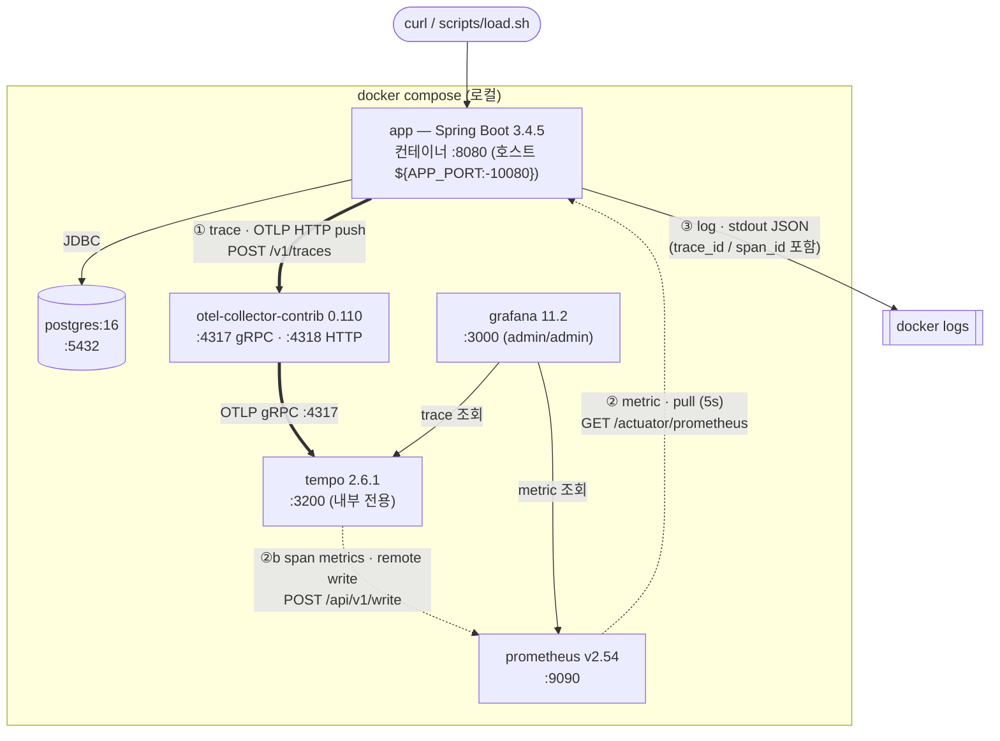
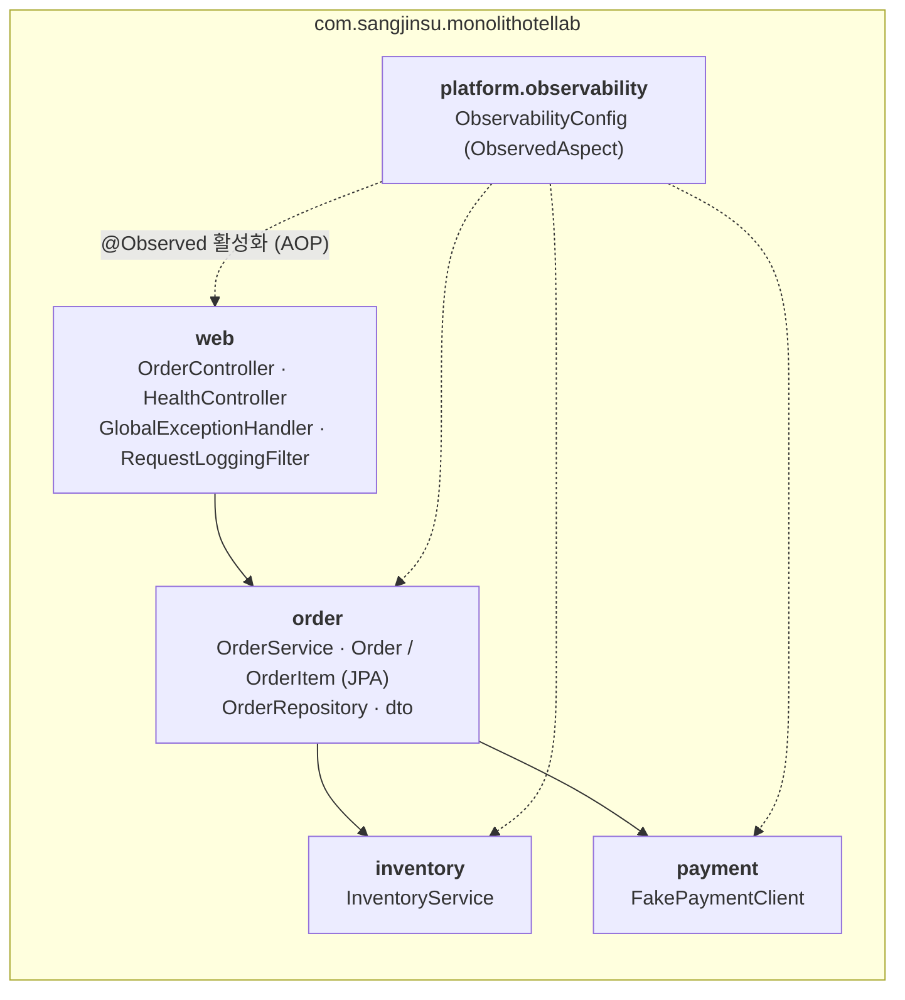
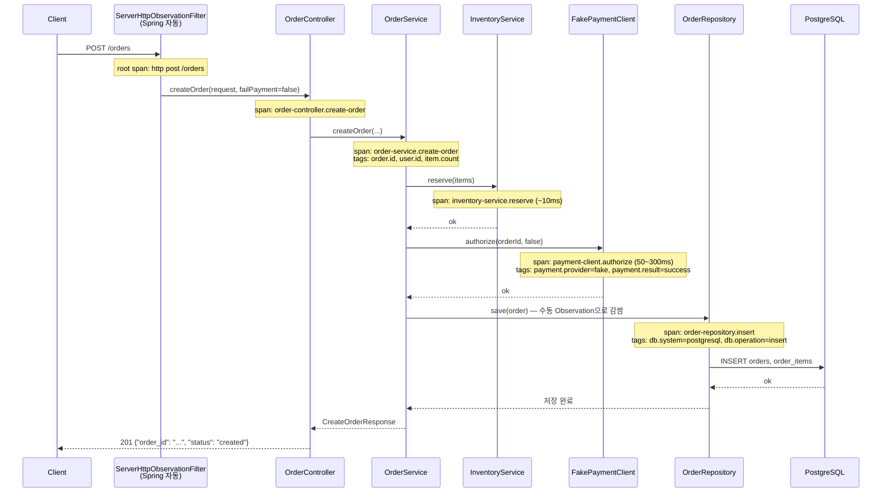
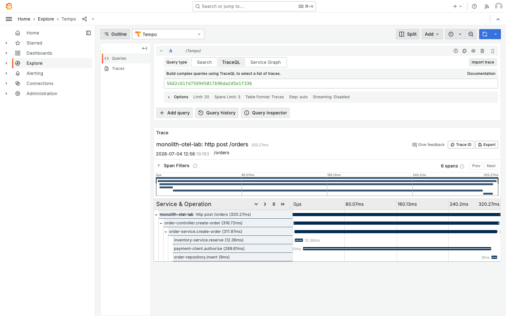
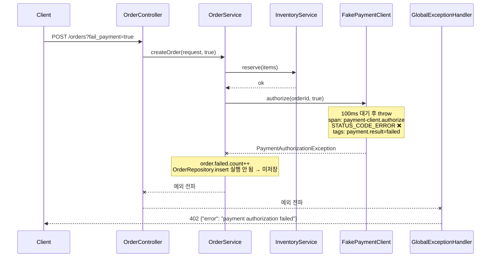
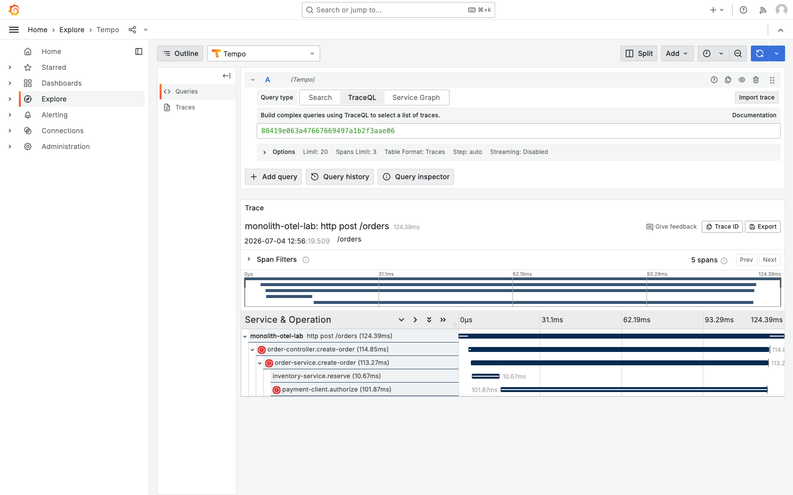

# 구성도 (Architecture)

이 문서는 monolith-otel-lab의 짜임새를 그림으로 설명한다.

- **동작 원리**가 궁금하면 → [observability-deep-dive.md](observability-deep-dive.md)
- **직접 실습**하려면 → [study-guide.md](study-guide.md)

---

## 1. 시스템 토폴로지 — 컨테이너 6개와 신호의 방향



**핵심: 세 신호는 서로 다른 세 경로로 흐른다.**

| 신호 | 전달 방식 | 경로 | 왜 이렇게? |
|---|---|---|---|
| ① Trace | **push** (앱이 보냄) | app → OTLP HTTP → Collector → Tempo | Collector를 경유하면 backend 교체가 쉬움 ([ADR-0003](../.workspace/decisions/ADR-0003-otel-tempo-stack.md)) |
| ② Metric | **pull** (Prometheus가 긁어감) | Prometheus → app `/actuator/prometheus` | Spring Actuator의 표준 방식 ([ADR-0004](../.workspace/decisions/ADR-0004-observability-micrometer.md)) |
| ②b Span Metric | **remote write** (Tempo가 보냄) | Tempo metrics-generator → Prometheus `/api/v1/write` | trace span에서 RED 지표를 만들기 위함 ([ADR-0007](../.workspace/decisions/ADR-0007-tempo-span-metrics.md)) |
| ③ Log | stdout | app → docker logs | 로그 자체는 수집기 없이, `trace_id`로 trace와 **상관**만 유지 |

push와 pull, Collector 경유와 직접 노출 — 실무에서 마주치는 두 패턴을 한 프로젝트에서 비교할 수 있다.

---

## 2. 애플리케이션 내부 — 패키지 = 계층 = span



이 프로젝트의 설계 원칙: **패키지 경계 = 계층 경계 = span 경계.**
코드에서 본 구조가 Grafana의 trace 트리에 그대로 나타난다.
(모놀리식 구조 결정: [ADR-0002](../.workspace/decisions/ADR-0002-monolith-structure.md))

---

## 3. 주문 생성 요청의 여정 (성공)



Tempo에서 실제로 보이는 trace 트리:

```text
http post /orders                        ← root (Spring MVC 자동)
 └─ order-controller.create-order
     └─ order-service.create-order
         ├─ inventory-service.reserve
         ├─ payment-client.authorize     ← 전체 지연의 대부분 (50~300ms)
         └─ order-repository.insert
```



> ⚠️ **span 이름이 코드와 다르다?** 코드의 `contextualName`은 `OrderService.createOrder`인데
> Tempo에는 `order-service.create-order`(kebab-case)로 보인다. Micrometer가 이름을 정규화하기
> 때문이다 — 원리는 [딥다이브 §3](observability-deep-dive.md#3-span-이름은-왜-kebab-case가-되는가) 참조.

---

## 4. 결제 실패 요청의 여정 (`?fail_payment=true`)





**실패 설계가 곧 학습 포인트다**: 결제 실패 시 `order-repository.insert` span 자체가 trace에
없다 — "저장하지 않았다"는 사실이 trace 구조에서 바로 읽힌다. 관측성이 비즈니스 규칙
(결제 성공 후에만 저장)을 증명하는 예다.

---

## 5. 설정 파일 지도 — 어떤 설정이 어떤 구간을 지배하는가

| 구간 | 파일 | 핵심 키 |
|---|---|---|
| 앱 → Collector (trace) | [`src/main/resources/application.yml`](../src/main/resources/application.yml) | `management.otlp.tracing.endpoint`, `management.tracing.sampling.probability` |
| Collector 수신/전달 | [`deploy/otel-collector/config.yaml`](../deploy/otel-collector/config.yaml) | `receivers.otlp`, `exporters.otlp/tempo`, `pipelines.traces` |
| Tempo 수신/저장 | [`deploy/tempo/tempo.yaml`](../deploy/tempo/tempo.yaml) | `distributor.receivers.otlp`, `storage.trace.local`, `compactor.compaction.block_retention`(**1h** — 오래된 trace는 사라진다!) |
| Span metrics 생성 | [`deploy/tempo/tempo.yaml`](../deploy/tempo/tempo.yaml) | `metrics_generator`, `overrides.defaults.metrics_generator.processors: [span-metrics]` |
| 메트릭 노출 | [`src/main/resources/application.yml`](../src/main/resources/application.yml) | `management.endpoints.web.exposure`, `metrics.distribution.percentiles-histogram` |
| 메트릭 수집/수신 | [`deploy/prometheus/prometheus.yml`](../deploy/prometheus/prometheus.yml), [`docker-compose.yml`](../docker-compose.yml) | `scrape_configs` → `app:8080` (5s), `--web.enable-remote-write-receiver` |
| 로그 ↔ trace 상관 | [`src/main/resources/logback-spring.xml`](../src/main/resources/logback-spring.xml) | MDC `traceId`/`spanId` → JSON 필드 `trace_id`/`span_id` 매핑 |
| Grafana 자동 설정 | [`deploy/grafana/provisioning/`](../deploy/grafana/provisioning/) | datasource uid `tempo`/`prometheus`, 대시보드 [`monolith-otel-lab.json`](../deploy/grafana/dashboards/monolith-otel-lab.json) |
| Alerting | [`deploy/grafana/provisioning/alerting/`](../deploy/grafana/provisioning/alerting/) | span metrics 기반 Grafana managed alert rule |
| 전체 조립 | [`docker-compose.yml`](../docker-compose.yml) | 서비스 6개, `OTEL_EXPORTER_OTLP_ENDPOINT`, `${APP_PORT:-10080}` |
| 로컬 Kubernetes | [`deploy/k8s/`](../deploy/k8s/), [`deploy/kustomization.yaml`](../deploy/kustomization.yaml) | kind, raw manifests, 기존 Grafana provisioning 재사용 |

---

## 6. 리소스 식별 — 이 telemetry는 누구 것인가

모든 trace/metric에는 다음 resource attribute가 붙는다 (application.yml):

```text
service.name             = monolith-otel-lab   (spring.application.name)
service.version          = 0.1.0
deployment.environment   = local
```

Grafana에서 여러 서비스가 섞여도 `service.name`으로 구분하는 것이 OTel의 기본 규약이다.
